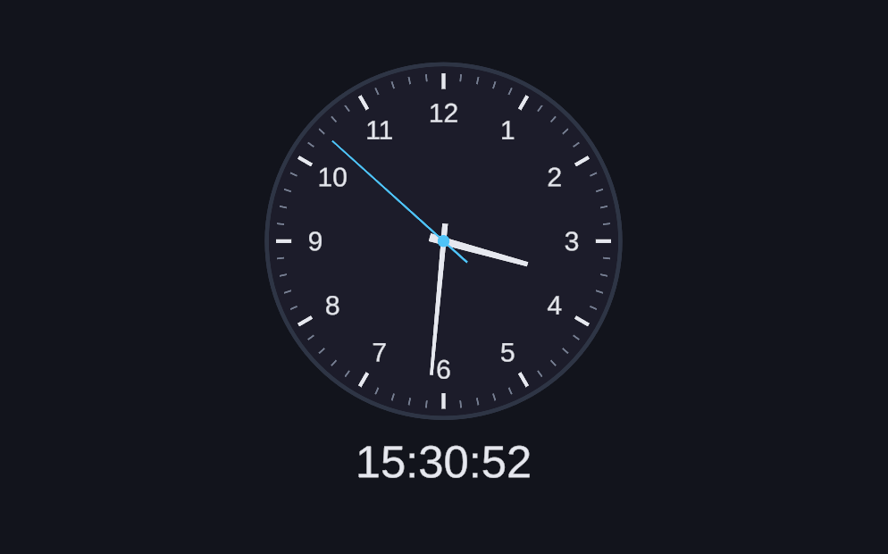
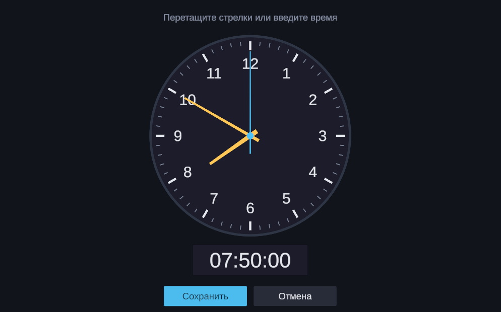

# Часы с синхронизацией времени

Тестовое задание Mirra Games.

**Демо:** https://leggion-ru.github.io/mirra-games-test-task/

| Часы | Редактирование |
|---|---|
|  |  |

## Что сделано

- При запуске время запрашивается с сервера, дальше часы идут сами, без повторных запросов.
- Аналоговый циферблат со стрелками и время текстом.
- Кнопка «Редактировать»: время можно выставить перетаскиванием часовой и минутной стрелок или ввести с клавиатуры. После «Сохранить» часы идут от нового времени.
- Сцена с часами загружается из локального бандла Addressables, пока она грузится, показывается экран загрузки.

## Как устроено

- `Bootstrap` — стартовая сцена: инициализирует Addressables, запрашивает время и загружает сцену `Clock` через `Addressables.LoadSceneAsync`.
- Сервисы (часы, запрос времени, загрузка сцен, экран загрузки) регистрируются в Zenject `ProjectContext`.
- `Clock` — циферблат, текстовое время и режим редактирования.

Время берётся с timeapi.io. Яндекс из браузера недоступен (его сервер не разрешает такие запросы — CORS), поэтому он используется только в редакторе. Если сервер не ответил, пробуются запасные источники, в крайнем случае берётся время устройства.

## Стек

Unity 2022.3.54f1, Zenject, UniTask, DOTween, Addressables, TextMesh Pro.

## Структура

```
Assets/_Project/
  Scenes/            Bootstrap, Clock
  Scripts/
    Core/            логика времени, стрелок и ввода
    Infrastructure/  запрос времени, загрузка сцен
    Presentation/    UI часов, редактирование, экран загрузки
    Bootstrap/       инсталлеры Zenject и запуск
    Editor/          сборка WebGL
  Tests/Editor/      тесты
```

## Сборка

Меню **Build → WebGL** собирает проект в `Builds/WebGL`, содержимое папки публикуется в ветку `gh-pages`.
